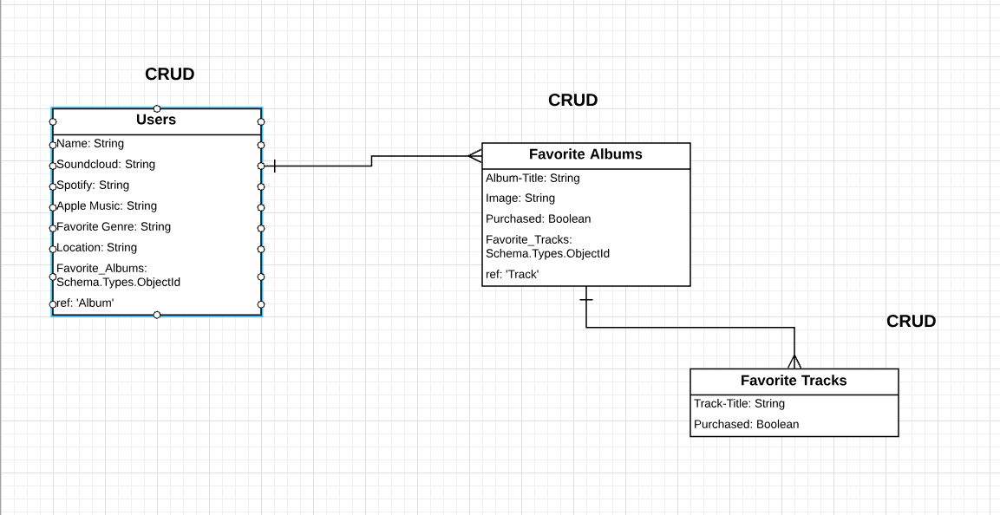

# Project2  Music Lovers

Project-2 WDI-18 

Heroku Site
https://peaceful-badlands-56889.herokuapp.com/

ERD
https://www.lucidchart.com/documents/edit/487d0f11-26cd-44fb-bc77-7bf746b05f79/0

Trello Board
https://trello.com/b/mfIjcn0v/project-2-wdi-18

Wireframes 

https://www.figma.com/file/Ggom9xTwY4owMX8gR4qMzePH/Project-2-Music-Lovers?node-id=2%3A79

This is a full stack application that will allows the user to monitor their profile, and allow them to Add their favorite music albums & the tracks from those perspective albums.

This application lacks security so in order for it to become a useful tool.

Music Lovers contains 3 RESTful routes including two which is embedded.
The models are as followed

Users Model -> Albums Model ---> Tracks Model

This is a list of the technologies used in this application

    * HTML5
    * CSS
    * JavaScript
    * Node.js
    * Express.js
    * MongoDB.js
    * Mongoose

